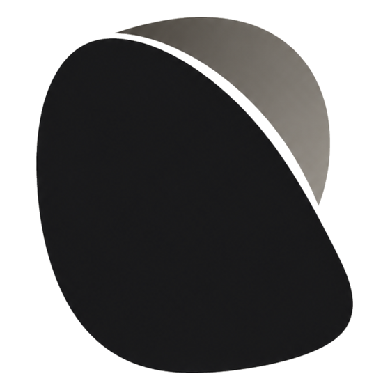

<div align="center">

<picture>
  <source media="(prefers-color-scheme: dark)" srcset="assets/skia-mark-dark.png">
  
</picture>

# Skia

**A local-first meeting copilot.**

Live transcription, structured notes, and answers grounded in your own documents —
running on your machine, with your own API key or a fully local model.

[](https://github.com/ApoorvDixitt/Skia/actions/workflows/ci.yml)
[](LICENSE)
[](#build-it-yourself)
[](docs/ROADMAP.md)

</div>

---

> [!IMPORTANT]
> **Pre-alpha — there is nothing to install yet.**
> Today this repository contains a Tauri v2 shell that compiles and opens a window. None of
> the features below are implemented. [`docs/ROADMAP.md`](docs/ROADMAP.md) is the honest
> account of what exists and what doesn't — worth reading before filing a feature request.
>
> `Skia` is a provisional codename (Greek *σκιά*, "shadow"). It collides with
> [Google's Skia graphics library](https://skia.org), with which this project has no
> affiliation, and will likely change before the first release — see [#1](https://github.com/ApoorvDixitt/Skia/issues/1).

## The idea

Most meeting tools hand you a transcript after everyone has hung up. Skia is meant to be
useful *while* you're still talking — and to do it without shipping your conversations to
somebody else's server.

- **Live transcription** with speaker labels, capturing both your microphone and the far end of the call.
- **Answers while you talk.** Hit a hotkey and get a streamed answer that cites your own material.
- **Your documents are the source of truth.** Drop in PDF, DOCX, TXT, or Markdown; every answer links back to the exact passage it came from.
- **A post-call pack** — summary, action items, and a follow-up draft.
- **Any model you like.** OpenAI, Anthropic, Gemini, Groq, or OpenRouter with your own key — or fully local through Ollama and Whisper, which costs nothing to run.
- **A quiet overlay.** No dock icon, no taskbar button, no bot joining your meeting, no notification sounds.

Everything is stored on your device in SQLite. There is no Skia server, no account, and no
telemetry — the app talks only to the model provider you configured, and to GitHub to check
for updates.

## What "quiet" actually means

Skia stays out of your way, but that means different things on different operating systems,
and the guarantees are narrower than "invisible". Here is the real picture:

| | Windows 10 2004+ / 11 | macOS |
|---|:---:|:---:|
| Overlay pixels excluded from screen capture and sharing | ✅ documented | ⚠️ measured, undocumented |
| No dock, taskbar, menu-bar, or alt-tab presence | ✅ | ✅ |
| No bot joins the call | ✅ | ✅ |
| Silent, remappable hotkeys | ✅ | ✅ |
| Never steals focus | ✅ | ✅ |
| Window hidden from *enumeration* by other apps | ❌ | ❌ |

**On Windows** this rests on `WDA_EXCLUDEFROMCAPTURE`, which is documented and supported.

**On macOS** it rests on `NSWindow.sharingType = .none`, and the situation is genuinely murky.
Apple's shipping SDK header says `.none` means the content cannot be captured; Apple's
[current documentation](https://developer.apple.com/documentation/appkit/nswindow/sharingtype-swift.enum/none)
calls it *"A legacy constant that macOS no longer uses"* and says *"Don't use this value to
hide or omit content from being captured."* An Apple engineer stated in
[July 2025](https://developer.apple.com/forums/thread/792152) that *"there are no public APIs
for preventing screen capture."*

We measured it rather than guessing. On **macOS 26.5**, `.none` **was** excluded from
ScreenCaptureKit, from legacy CoreGraphics capture, and from full-screen shares in Google Meet
and Zoom — verified from a second device, and holding across switching displays, windows, and
tabs. So it works today. But there is no contract, Apple has an open bug where the exclusion
[breaks after a capture filter is rebuilt](https://developer.apple.com/forums/thread/808016),
and a point release could change it without notice. Treat it as a bonus, never a guarantee.
The [harness](tools/macos-capture-harness) re-measures it on any macOS version.

### Pixels are not presence

This distinction matters more than the table:

- **Excluded** — the overlay's *pixels* are withheld from a capture stream.
- **Not excluded** — the window's *existence*. Any app that asks the OS can still see the
  window, its owning process, its size and position, and the fact that its sharing state is
  set to `.none`. That value is unusual enough to be a signal in itself.

So Skia can keep its contents out of a screen share. It cannot make itself undiscoverable, and
it does not defend against device management, kernel-level monitoring, or someone pointing a
second camera at your screen. No user-space app can, and Skia doesn't claim to.

## Intended use

Skia is for having better recall during, and a better record of, **your own** conversations:
sales and customer calls, user interviews and discovery, recruiting screens, consulting
sessions, and studying from your own notes.

Two things are yours to handle, not the app's:

- **Consent.** Recording and transcription laws vary by jurisdiction — many places require
  everyone on the call to agree — and meeting platforms add their own policies. Skia shows a
  visible indicator whenever it's listening, but getting consent is on you.
- **Where you use it.** Please don't use Skia anywhere you've agreed not to use assistance.
  That isn't what this project is for.

## Build it yourself

No releases exist yet, so building from source is the only way to run it.

**You'll need** [Rust](https://rustup.rs) (stable) and [Node.js](https://nodejs.org) 20+ with
[pnpm](https://pnpm.io) 9. On macOS, Xcode Command Line Tools (`xcode-select --install`); on
Windows, the [Microsoft C++ Build Tools](https://visualstudio.microsoft.com/visual-cpp-build-tools/)
and the WebView2 runtime (already present on Windows 11).

```bash
git clone https://github.com/ApoorvDixitt/Skia.git
cd Skia
pnpm install
pnpm tauri dev      # run with hot reload
pnpm tauri build    # bundle into src-tauri/target/release/bundle
```

Before opening a pull request, run what CI runs:

```bash
pnpm lint --max-warnings 0
pnpm typecheck
pnpm build
cargo fmt --manifest-path src-tauri/Cargo.toml --check
cargo clippy --manifest-path src-tauri/Cargo.toml --all-targets -- -D warnings
```

## Under the hood

A single [Tauri v2](https://tauri.app) app: React and TypeScript in the webview, with
everything native, real-time, or filesystem-touching living in Rust behind Tauri's IPC.

| | |
|---|---|
| Shell | Tauri v2 (Rust) |
| Frontend | React, TypeScript, Vite |
| Storage | SQLite with FTS5 |
| Retrieval | sqlite-vec + BM25, fused and reranked |
| Transcription | Deepgram Nova-3 (cloud) or whisper-rs (local) |
| Audio capture | cpal, WASAPI loopback, ScreenCaptureKit / CoreAudio |

One repository builds both platforms from the same commit; per-OS behaviour is handled with
`#[cfg(target_os = "...")]` rather than separate branches.

## Documentation

| | |
|---|---|
| [Architecture](docs/ARCHITECTURE.md) | How the app fits together, where code belongs, and the design constraints that are expensive to discover late |
| [Roadmap](docs/ROADMAP.md) | Phases, priorities, what's explicitly out of scope, and the open questions |
| [Releasing](docs/RELEASING.md) | Versioning, the tag-driven pipeline, and what shipping unsigned means |
| [Contributing](CONTRIBUTING.md) | Fork-and-pull-request workflow, commit conventions, local setup |

## Contributing

Contributions are welcome. The architecture is still moving quickly, so for anything
substantial please **open an issue first** — it saves you building against a design that's
about to change.

The workflow is standard fork-and-pull-request: fork the repo, branch off `main`, commit using
[Conventional Commits](https://www.conventionalcommits.org), and open a PR. `main` is
protected — CI has to pass on both macOS and Windows, and PRs are squash-merged to keep
history linear. [`CONTRIBUTING.md`](CONTRIBUTING.md) has the exact commands.

Good places to start: the [`phase-0`](https://github.com/ApoorvDixitt/Skia/labels/phase-0)
issues are self-contained investigations that don't require understanding the whole codebase,
and answering them genuinely shapes the project.

Everyone participating is expected to follow the [Code of Conduct](CODE_OF_CONDUCT.md).
Security problems should go through [private reporting](SECURITY.md), not a public issue.

## License

[Apache License 2.0](LICENSE) © 2026 Apoorv Dixit

The license covers the code, including a patent grant. It deliberately does **not** cover the
project's name or logo — see [TRADEMARKS.md](TRADEMARKS.md) for what that means in practice.
